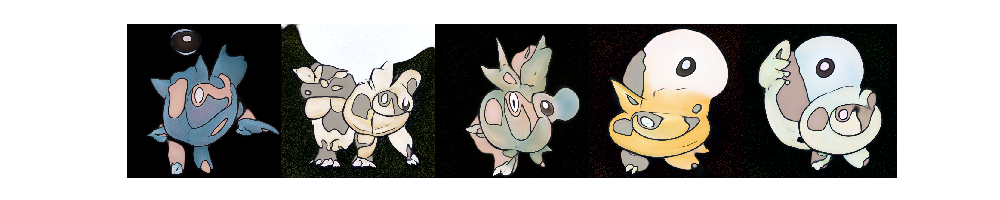

# StyleGAN Pokemon



## Run

### Environment

```bash
conda env create -f environment.yml
conda activate stylegan-pokemon
```

### Get Dataset

```bash
aws s3 cp s3://devopstar/resources/stylegan-pokemon/network-snapshot-007961.pkl stylegan/network-snapshot-007961.pkl
aws s3 sync s3://devopstar/resources/stylegan-pokemon/kaggle-one-shot-pokemon stylegan/kaggle-one-shot-pokemon
cd stylegan
mkdir pokemon
```

### Prepare Images

```bash
python prepare.py
python dataset_tool.py create_from_images datasets/smalls/ ./pokemon/
```

### Train

```bash
python train.py
```

### Invoke

```bash
python invoke.py
```

## Attribution

* [One-Shot-Pokemon Images](https://www.kaggle.com/aaronyin/oneshotpokemon)