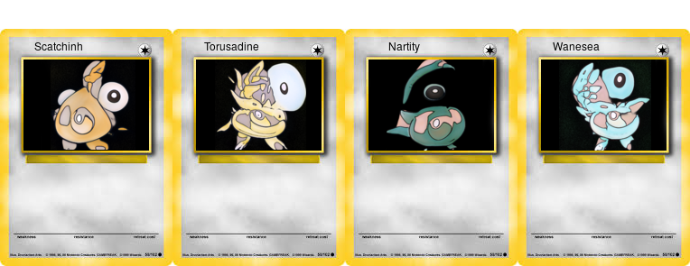

# Pokemon Card Generator



## Run StyleGAN

### StyleGAN Environment

```bash
conda env create -f environment.yml
conda activate stylegan-pokemon
cd stylegan
```

#### StyleGAN Dataset

```bash
aws s3 cp s3://devopstar/resources/stylegan-pokemon/network-snapshot-007961.pkl network-snapshot-007961.pkl
aws s3 sync s3://devopstar/resources/stylegan-pokemon/kaggle-one-shot-pokemon kaggle-one-shot-pokemon
mkdir pokemon
```

#### Prepare Images

```bash
python prepare.py
python dataset_tool.py create_from_images datasets/smalls/ ./pokemon/
```

#### StyleGAN Training

```bash
python train.py
```

#### StyleGAN Invoke

```bash
python invoke.py
```

## Run RNN

### RNN Environment

```bash
conda activate stylegan-pokemon
cd rnn
```

#### RNN Dataset

Dataset is from [armgilles/pokemon.csv](https://gist.github.com/armgilles/194bcff35001e7eb53a2a8b441e8b2c6)

```bash
ls -al data/input.txt
```

#### RNN Training

```bash
python train.py --data_dir=./data/ --seq_length=12
```

#### RNN Invoke

```bash
python sample.py
```

### Cropping

```bash
./cropper.sh "Pokemon Name"
```

## Attribution

* [One-Shot-Pokemon Images](https://www.kaggle.com/aaronyin/oneshotpokemon)
* [Inspired from Andrej Karpathy's char-rnn](https://github.com/karpathy/char-rnn)
* [Pokemon generated by neural network](https://aiweirdness.com/post/147834883707/pokemon-generated-by-neural-network)